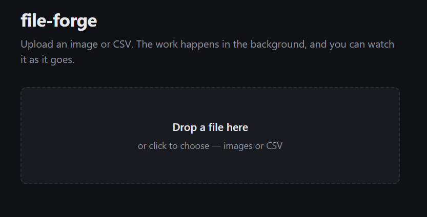
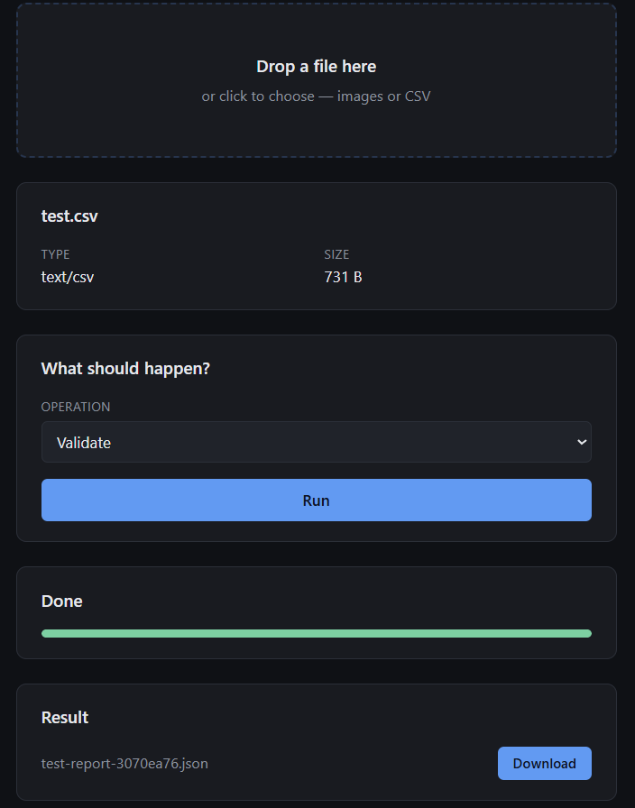
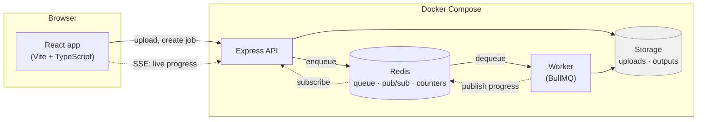

# file-forge

Upload a file, and it gets processed in the background while you watch the
progress arrive live. Images are resized, converted and thumbnailed; CSVs
are validated and cleaned by **streaming** them, so a file far larger than
available memory goes through without trouble.

Node.js, Express and TypeScript on the back; React on the front; Redis-backed
job queues in between. **113 tests**, all green.

<!-- Replace with your own screenshot; see docs/screenshots/README.md -->



The number this project exists to demonstrate:

```
rows         file size    peak heap
   10,000       0.4 MB       4.8 MB
  200,000       8.0 MB      12.7 MB
1,000,000      40.7 MB      12.5 MB
3,000,000     126.3 MB      12.9 MB
```

The file grows by a factor of three hundred; the heap does not move.

## Why this design

A file upload that is processed inside the HTTP request holds the
connection open for as long as the work takes — seconds for a large
image, longer for a big CSV — and ties up a server thread while the
caller's browser spins. So the API does the least it can: accept the
file, hand back a job id, and put the work on a queue. A separate worker
process picks it up.

That split is what makes the rest possible: progress reporting, retries
on failure, and processing several files at once without the API ever
slowing down.

## The interface

```bash
docker compose up -d      # API, worker, Redis
cd frontend && npm run dev
```

Then open http://localhost:5173.

The frontend imports the backend's `src/shared/contract.ts` directly, so
the two cannot disagree about what the API looks like — rename a field on
the server and the frontend stops compiling, rather than reading
`undefined` in a browser somewhere. The contract is the only backend file
the frontend touches, and it imports nothing but Zod, so no server
dependency is dragged into the bundle.

Progress comes from `EventSource` rather than polling, so the bar moves as
the work happens. Download URLs are requested from the server rather than
built by hand, which means the same code works whether or not signed
downloads are switched on.

## Architecture



Three processes, one image. The API and the worker are separate on
purpose: resizing a large image or parsing a million-row CSV takes
seconds, and doing that inside an HTTP request would hold the caller's
connection open, occupy the server, and leave no way to retry. So the API
does the least it can — accept the file, return a job id — and the worker
picks the work up from the queue.

The dotted arrows are the live-progress path. The worker knows the
percentage; the browser needs it; the two never speak. Redis pub/sub
carries events from one to the other, and the API forwards them to
whoever is watching over Server-Sent Events.

## Quick start

```bash
docker compose up --build
```

- **API:** http://localhost:3000
- **Health:** http://localhost:3000/health/ready

Or run it directly:

```bash
npm install
npm run dev
```

## Development

```bash
npm run dev        # watch mode, restarts on change
npm test           # run the test suite
npm run typecheck  # TypeScript, no emit
npm run build      # compile to dist/
```

Configuration comes from the environment; copy `.env.example` to `.env`
to override defaults. Nothing reads `process.env` outside `src/config.ts`,
so every setting is validated once at startup and a bad value fails
immediately rather than at some later moment.

## Uploading

```bash
curl -F "file=@photo.png" http://localhost:3000/uploads
# -> {"id":"...","originalName":"photo.png","mimeType":"image/png","size":12345,...}

curl http://localhost:3000/uploads/<id>
```

Uploads are streamed to a temporary file rather than buffered in memory,
so a large file — or fifty concurrent ones — does not grow the heap. The
storage key is generated, never derived from the submitted filename, so a
name like `../../etc/passwd` cannot influence where bytes land; the
original name is kept as metadata only.

| Limit | Behaviour |
|---|---|
| Over `MAX_UPLOAD_BYTES` | `413 file_too_large` |
| Type outside the allow-list | `415 unsupported_type` |
| No file in the request | `400 no_file` |

## Processing a file

Upload first, then ask for work. The two are separate so a file can be
processed more than once, with different settings each time.

```bash
# 1. upload
curl -F "file=@photo.png" http://localhost:3000/uploads
# -> {"id":"abc123",...}

# 2. queue some work — returns immediately with 202 Accepted
curl -X POST http://localhost:3000/jobs \
  -H "Content-Type: application/json" \
  -d '{"fileId":"abc123","operation":"image.resize"}'
# -> {"id":"1","state":"queued",...}

# 3. check on it
curl http://localhost:3000/jobs/1
# -> {"id":"1","state":"completed","progress":100,"result":{...}}
```

Then download what it produced — the key comes back in `result.outputs`:

```bash
curl -o resized.png http://localhost:3000/files/outputs/<key>
```

### Operations

| Operation | Options | Produces |
|---|---|---|
| `image.resize` | `width` and/or `height`, `fit`, `withoutEnlargement` | same format, scaled |
| `image.convert` | `format` (jpeg/png/webp/avif), `quality` | converted image |
| `image.thumbnail` | `size` (16–512) | square WebP preview |
| `csv.validate` | `hasHeader`, `delimiter` | JSON report |
| `csv.transform` | `columns`, `trim`, `dropEmptyRows` | cleaned CSV |

Aspect ratio is preserved by default and images are never enlarged.
Output dimensions are capped, because an unbounded resize is a cheap way
to exhaust memory.

### Signed downloads

Leaving `DOWNLOAD_SECRET` empty keeps `/files/...` open, which is what you
want locally. Set it and every download needs a signature:

```bash
curl -X POST http://localhost:3000/files/links -H "Content-Type: application/json" -d '{"key":"outputs/photo-resized-1a2b.png"}'
# -> {"url":"/files/outputs/...?expires=...&signature=...","expiresAt":"..."}
```

The signature is an HMAC over the key and the expiry, so a link cannot be
forged, moved to another file, or given more time — editing any part of it
invalidates it. Unsigned requests get 403, tampered ones 403, expired ones
410. Nothing is stored server-side; the link carries its own proof.

### Cleanup

Uploads are transient, so files older than `FILE_RETENTION_HOURS` are
deleted by a repeatable job every `CLEANUP_INTERVAL_MINUTES`. A repeatable
job rather than an interval timer, because with several workers running an
interval would have all of them sweeping the same directory at once.

Redis metadata expires on its own, which is what makes the sweep
necessary: without it you end up with bytes on disk that no record points
at any more.

### Streaming, and why it matters

CSV work never holds the file in memory. Rows arrive one at a time from
the parser, pass through a transform, and leave through the stringifier
to storage — so at any instant only a handful of rows exist. Measured on
this machine:

```
rows         file size    peak heap
   10,000       0.4 MB       4.8 MB
  200,000       8.0 MB      12.7 MB
1,000,000      40.7 MB      12.5 MB
3,000,000     126.3 MB      12.9 MB
```

The file grows by a factor of 300; the heap does not move. The obvious
implementation — read it, parse it into an array, work on the array —
would have needed several times the file size, and died somewhere around
the third row of that table.

**Validation happens twice.** The upload endpoint checks the declared
type and, when that is generic, the file extension — both of which a
caller controls. The real check is at processing time: sharp either
decodes the bytes as an image or the job fails. A `.png` that is actually
something else gets through the first check and fails the second.

### Watching a job live

Polling works, but the server can push instead:

```bash
curl -N http://localhost:3000/jobs/1/events
```

```
data: {"jobId":"1","state":"processing","progress":10}

data: {"jobId":"1","state":"processing","progress":80}

data: {"jobId":"1","state":"completed","progress":100,"result":{...}}
```

Server-Sent Events rather than WebSockets, because updates only travel one
way — and browsers reconnect dropped SSE streams on their own. The worker
publishes to Redis, the API subscribes and forwards, so the two processes
never need to talk directly. The stream opens with the job's current
state (a client joining late still learns the outcome) and closes once
the job settles.

States are `queued`, `processing`, `retrying`, `completed`, `failed`.
Failed jobs are retried three times with exponential backoff; a failure
that will never succeed — a file that no longer exists — is not retried.

## Limits and monitoring

Every endpoint class has its own allowance, because they do not cost the
same: an upload consumes disk, a job consumes CPU, and asking after a job
consumes almost nothing.

| Traffic | Per minute |
|---|---|
| Reads and downloads | 120 |
| Uploads | 20 |
| Job creation | 40 |
| Job status polling | 300 |

Over the limit gives `429` with a `Retry-After` header. Counters live in
Redis so the limit holds across however many API processes are running —
and the limiter **fails open**: if Redis is unreachable requests are
allowed through, because a rate limiter that takes the service down has
done more damage than the traffic it was guarding against.

Two views of the same numbers:

```bash
curl http://localhost:3000/status    # JSON, for a person
curl http://localhost:3000/metrics   # Prometheus, for a scraper
```

Both are mounted ahead of the rate limiters, so monitoring keeps working
exactly when traffic is highest.

## Health endpoints

Two checks, answering different questions:

| Endpoint | Question | Checks dependencies? |
|---|---|---|
| `/health/live` | Is the process running? | No — deliberately |
| `/health/ready` | Can it serve traffic? | Yes, and names what is broken |

Liveness ignores Redis on purpose: restarting the container would not fix
a broken Redis, so a Redis blip must not trigger a restart loop.

## Tech stack

Node.js 22, Express 5, TypeScript, Redis (ioredis), Zod for validation,
pino for structured logging, Vitest for tests, Docker Compose.

## Project layout

```
src/
├── app.ts           Express app: middleware, routing, error shape
├── server.ts        API entry point
├── config.ts        validated settings; nothing else reads process.env
├── storage.ts       Storage interface + local-disk implementation
├── ratelimit.ts     Redis-backed limiter, per endpoint class
├── metrics.ts       /status and /metrics
├── files/           uploads, downloads, signed links, metadata
├── jobs/            queue, worker, processors, SSE, cleanup
└── shared/          the API contract, imported by both sides
frontend/src/        React app: dropzone, picker, progress, results
tests/               113 tests against real Redis
```

## What it demonstrates

- **Streaming over buffering.** CSV work never holds a file in memory;
  the measurements above are the point of the design, not a side effect.
- **Background work.** Queue, retries with backoff, capped concurrency,
  and failures separated into those worth retrying and those that are not.
- **Live updates without WebSockets.** Redis pub/sub from worker to API,
  Server-Sent Events from API to browser.
- **One contract, two sides.** The frontend imports the server's type
  definitions, so drift is a compile error rather than a runtime surprise.
- **Failing open.** Rate limiting, metrics and progress publishing all
  degrade rather than break when Redis is unavailable.

## License

MIT
